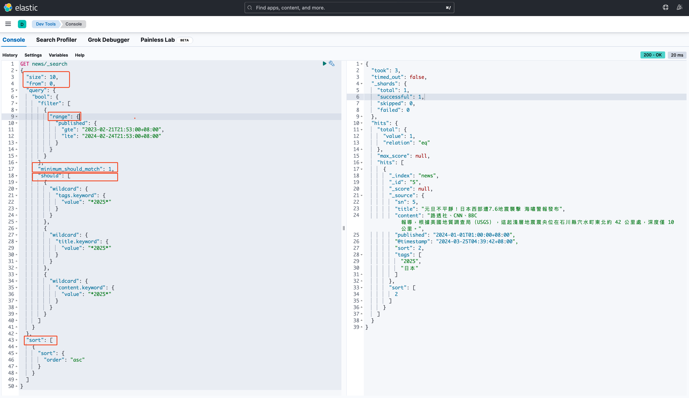

## 架構說明
1. 當api收到request後，把資料儲存到mariadb的同時，也透過http request寫入至logstash
2. logstash 當有新資料寫入時，會先將input data 做格式化處理後，再寫入至 elasticsearch
3. user透過elasticsearch提供的api，輸入查詢條件，得到特地的資料

## 1. Install prerequisite
### docker
```bash
sudo apt update
```
```bash
sudo apt install apt-transport-https ca-certificates curl software-properties-common
```
```bash
curl -fsSL https://download.docker.com/linux/ubuntu/gpg | sudo gpg --dearmor -o /usr/share/keyrings/docker-archive-keyring.gpg
```
```bash
echo "deb [arch=$(dpkg --print-architecture) signed-by=/usr/share/keyrings/docker-archive-keyring.gpg] https://download.docker.com/linux/ubuntu $(lsb_release -cs) stable" | sudo tee /etc/apt/sources.list.d/docker.list > /dev/null
```
```bash
sudo apt update
```
```bash
apt-cache policy docker-ce
```
```bash
sudo apt install docker-ce
```
```bash
sudo systemctl status docker
```

## 2. Install elk
+ bootstrap: `docker compose up -d`
+ elasticsearch: http://localhost:9200
+ kibana: http://localhost:5601
+ logstash: http://localhost:8383

### delete elasticsearch index
```bash
curl --request DELETE \
  --url http://localhost:9200/news
```

### uninstall elk
> 注意：所有資料將被刪除

```bash
docker compose down -v
```

## 3. Restart service
> scenario: after config changed

+ stop: `docker compose stop logstash`
+ start: `docker compose start logstash`

## 4. Insert into logstash
```bash
curl --request POST \
  --url http://localhost:8383 \
  --header 'Content-Type: application/json' \
  --data '{"sn":7,"title":"台積熊本廠開幕","content":"台積電熊本廠即將在2月24日盛大開幕，二廠也拍板動工，選擇在日本設廠","published":"2024-01-01T03:00:00+08:00","sort":2,"tags":["台積電","2024","台灣"]}'
```

### how to watch logstash
```bash
docker logs -f logstash
```

### data structure
```json
{
  "sn": 3,
  "title": "台積熊本廠開幕",
  "content": "台積電熊本廠即將在2月24日盛大開幕，二廠也拍板動工，選擇在日本設廠",
  "published": "2024-01-01T03:00:00+08:00",
  "sort": 2,
  "tags": [
    "2024",
    "台積電",
    "台灣"
  ]
}
```
## 5. "Discovery" of kibana


## 6. "Dev Tools" of kibana


+ `size`: 回傳資料的筆數限制
+ `from`: 回傳資料的起始位置
+ `query.bool.filter[0].range`: 表示時間區間
+ `query.bool.should`: 表示 `or` condition
+ `sort[0].sort`: 表示以 `sort` 欄位做排序

```json
GET news/_search
{
  "size": 10,
  "from": 0,
  "query": {
    "bool": {
      "filter": [
        {
          "range": {
            "published": {
              "gte": "2023-02-21T21:53:00+08:00",
              "lte": "2024-02-24T21:53:00+08:00"
            }
          }
        }
      ],
      "should": [
        {
          "wildcard": {
            "tags.keyword": {
              "value": "*2024*"
            }
          }
        },
        {
          "wildcard": {
            "title.keyword": {
              "value": "*2024*"
            }
          }
        },
        {
          "wildcard": {
            "content.keyword": {
              "value": "*2024*"
            }
          }
        }
      ]
    }
  },
  "sort": [
    {
      "sort": {
        "order": "asc"
      }
    }
  ]
}
```

## 7. elasticsearch api
### request
```bash
curl --request GET \
  --url http://localhost:9200/news/_search \
  --header 'Content-Type: application/json' \
  --data '{
  "size": 10,
  "from": 0,
  "query": {
    "bool": {
      "filter": [
        {
          "range": {
            "published": {
              "gte": "2023-02-21T21:53:00+08:00",
              "lte": "2024-02-24T21:53:00+08:00"
            }
          }
        }
      ],
      "should": [
        {
          "wildcard": {
            "tags.keyword": {
              "value": "*2024*"
            }
          }
        },
        {
          "wildcard": {
            "title.keyword": {
              "value": "*2024*"
            }
          }
        },
        {
          "wildcard": {
            "content.keyword": {
              "value": "*2024*"
            }
          }
        }
      ]
    }
  },
  "sort": [
    {
      "sort": {
        "order": "asc"
      }
    }
  ]
}'
```
### response


+ `hits.total.value`: 資料總筆數
+ `hits.hits[#]._source.tags`: news tags
+ `hits.hits[#]._source.sn`: primary key
+ `hits.hits[#]._source.sort`: 等級
+ `hits.hits[#]._source.title`: news 標點
+ `hits.hits[#]._source.content`: news 內容
+ `hits.hits[#]._source.published`: news發布時間，資料格式為`yyyy-MM-ddTHH:mm:ss.SSSZ`
+ `hits.hits[#]._source.['@timestamp']`: 資料異動時間

## 99. example data to redis
```json
{"sn":1,"title":"2024台灣總統大選","content":"當選人:AAA","published":"2024-02-22T20:23:00+08:00","sort":2,"tags":["總統","2024","台灣"]}
```
```json
{"sn":2,"title":"2024美國總統大選","content":"當選人:BBB","published":"2024-09-20T21:53:00+08:00","sort":4,"tags":["總統","2024","美國"]}
```
```json
{"sn":3,"title":"以色列直攻哈瑪斯大堡壘","content":"自從以色列與哈瑪斯去年10月7日交戰以來，這已是布林肯第5度親自走訪中東。他接著還將前往以色列和卡達。","published":"2021-05-30T03:00:00+08:00","sort":3,"tags":["以色列"]}
```
```json
{"sn":4,"title":"台灣多處遭重油污染","content":"綠島遭重油汙染，連螃蟹都被重油覆蓋全身","published":"2024-01-01T12:00:00+08:00","sort":5,"tags":["2024", "台灣"]}
```
```json
{"sn":5,"title":"元旦不平靜！日本西部遭7.6地震襲擊 海嘯警報發布","content":"路透社、CNN、BBC 報導，根據美國地質調查局（USGS），這起淺層地震震央位在石川縣穴水町東北約 42 公里處，深度僅 10 公里。","published":"2024-01-01T01:00:00+08:00","sort":2,"tags":["2024","日本"]}
```
```json
{"sn":6,"title":"逾6成日企擔憂台灣局勢","content":"國際顧問公司安侯建業26日公布針對日本企業調查「何為經濟安全最重大風險因素」，結果顯示逾6成日企指出「台灣局勢」居冠，其次依序為「中國增強貿易管制」、「美對中貿易管制加劇」。","published":"2024-01-01T02:00:00+08:00","sort":2,"tags":["台積電","日本"]}
```
```json
{"sn":7,"title":"台積熊本廠開幕","content":"台積電熊本廠即將在2月24日盛大開幕，二廠也拍板動工，選擇在日本設廠","published":"2024-01-01T03:00:00+08:00","sort":2,"tags":["台積電","2024","台灣"]}
```